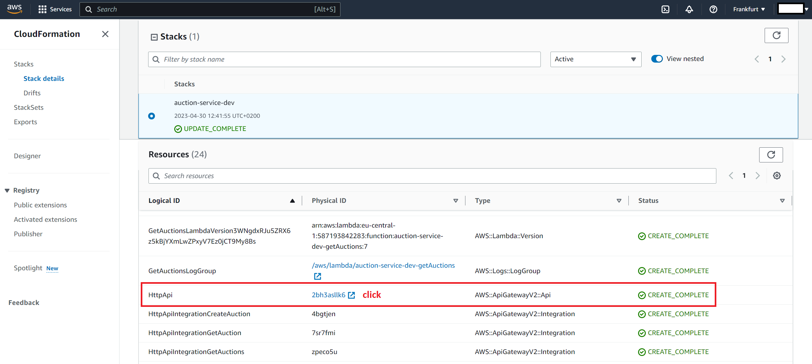
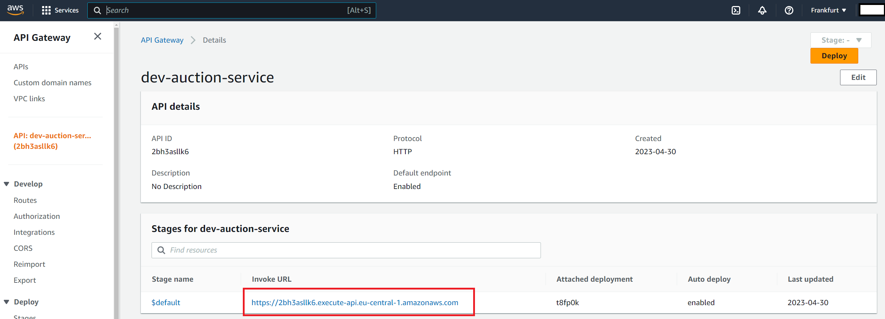

# udemy-serverless

https://www.udemy.com/course/serverless-framework/

## Project Overview


### Section 01 - 04

- Creating simple Lambdas / API Endpoints for createAuction, getAuction, getAuctions and placeBid
- Creating a DynamoDB Table to persist the data

### Section 05

- Creating scheduled Lambda
- Create global secondary index in DynamoDB
- Use query and newly created index to get items from DB
- JSONSchema bunch of things

Creating a new or developing a scheduled lambda is tedious, so during development the trigger can be commented out

```yml
functions:
  processAuctions:
    handler: src/handlers/processAuctions.handler
    # events:
    #   - schedule: rate(1 minute)
```

and the lambda can be triggered manually.

```
serverless invoke -f processAuctions --stage dev -l
```

### Section 06

- Create auth0 account -> tenant -> application -> test user
- Add auth0 login to rest client in order to get the ID_TOKEN of the test user
- Clone project `auth-service`
  - Add `secret.pem` and copy/paste cert from auth0
  - Ofc deployment failed... add region and stage, update dependencies
  - Update `auth.js` to support both GatewayV1 and GatewayV2
- Add auth-service `/private` to rest client for testing purposes
- Add authorizer to auction-service API endpoints

## Commands

### Deploying

https://www.serverless.com/framework/docs/providers/aws/guide/deploying

Deploying a service aka a project or application

```
npm run deploy
```

Deploying a function after some code changes

```
npm run deploy:func createAuction
```

### Removing

https://www.serverless.com/framework/docs/providers/aws/cli-reference/remove

Stack removal / take down application

```
npm run remove
```

## URL

Getting the URL of the auction service in order to hit the lambdas.

Open the Resources Tab of the CloudFormation Stack. Look for the Logical ID `HttpApi` or the Type `AWS::ApiGatewayV2::Api`. Use the link to open the ApiGateway resource. The Invoke URL is the URL of the service endpoint.




