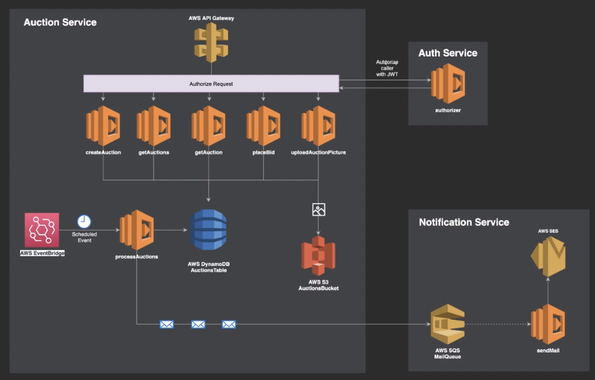

# udemy-serverless

https://www.udemy.com/course/serverless-framework/

## Project Overview



## Commands

### Deploying

https://www.serverless.com/framework/docs/providers/aws/guide/deploying

Deploying a service aka a project or application

```
serverless deploy --stage dev --verbose
```

Deploying a function after some code changes

```
serverless deploy function --function createAuction
```

### AWS - Remove

https://www.serverless.com/framework/docs/providers/aws/cli-reference/remove

Stack removal / take down application

```
serverless remove --verbose
```
